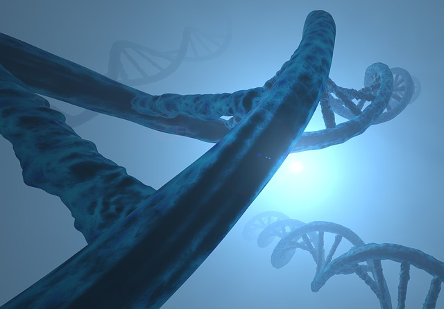

# Few random OpenShift Tutorials

[K8S Basics on OpenShift](https://github.com/stefan-bergstein/openshift-tutorials/tree/main/k8s-basics)

[Getting Started with OpenShift for Developers](https://github.com/stefan-bergstein/openshift-tutorials/blob/main/getting-started-openshift-dev/getting-started-openshift-dev.md)

[Deploying Applications From Images](https://github.com/stefan-bergstein/openshift-tutorials/blob/main/deploying-images/deploying-applications-from-images.md)

[CI/CD with Azure DevOps and OpenShift](https://github.com/stefan-bergstein/openshift-tutorials/tree/main/azure-devops)

[Machine Learning Model Monitoring](https://github.com/stefan-bergstein/openshift-tutorials/tree/main/ml-monitoring)

[Configuring custom domains for applications - the operator-way!](https://github.com/stefan-bergstein/openshift-tutorials/tree/main/custom-domains-for-applications)
