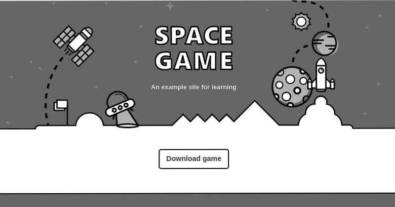
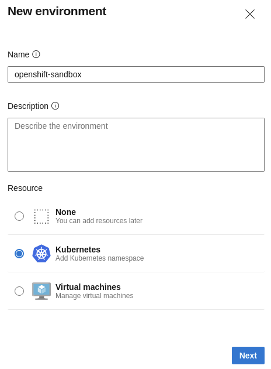
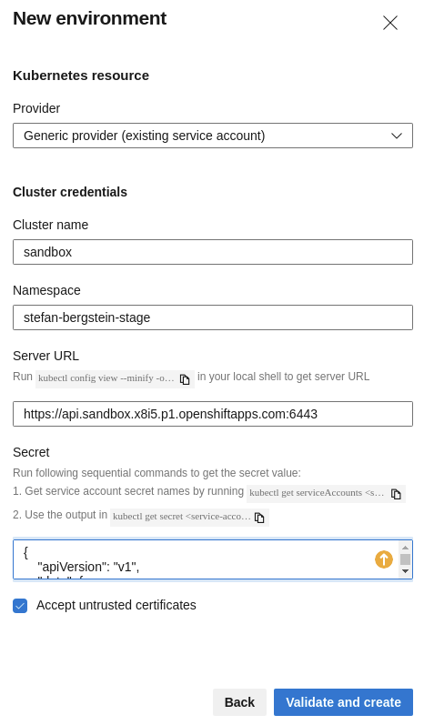
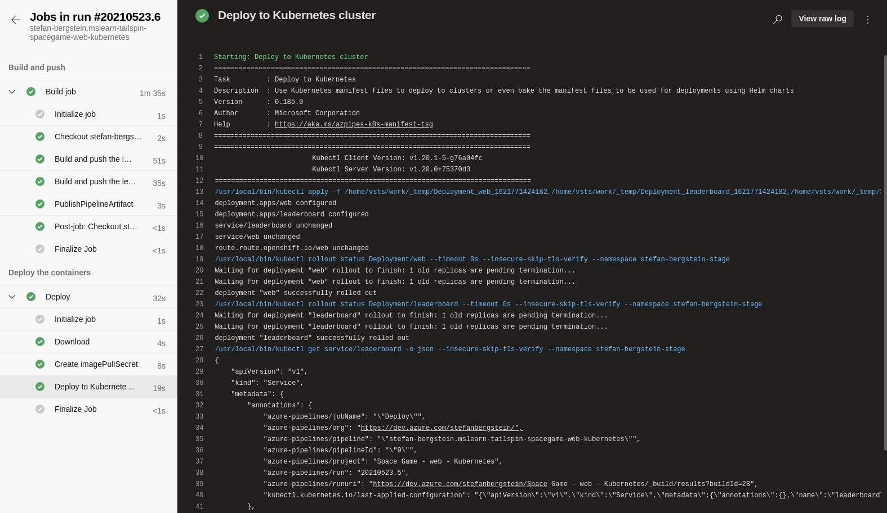
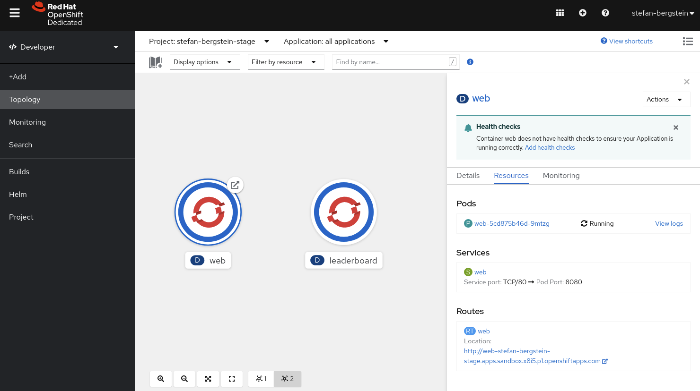

# How to rock CI/CD with Azure DevOps and OpenShift in 6 easy steps


**Azure DevOps enables you to build, test, and deploy any application to any cloud or on premises. Red Hat OpenShift is the leading enterprise Kubernetes platform, built for an open hybrid cloud strategy. Learn how to configure release pipelines in Azure DevOps and deploy your applications on Red Hat OpenShift**.



In this tutorial I am going to show you how-to set up a CI/CD pipeline in [Azure DevOps](https://azure.microsoft.com/en-us/services/devops/) that builds a small .NET application and finally deploys it to OpenShift.

The steps are based on the Microsoft learning path module [Automate multi-container Kubernetes deployments with Azure Pipelines](https://docs.microsoft.com/en-us/learn/modules/deploy-kubernetes/). But instead of deploying to AKS, the application is deployed on OpenShift.

### 6 steps to success

1.  Set up a OpenShift Kubernetes cluster
2.  Set up an Azure DevOps environment
3.  Create an Azure Container Registry
4.  Create Kubernetes connection
5.  Update a few Kubernetes manifests and the pipeline
6.  Build and deploy the application to OpenShift

## Setup your OpenShift Kubernetes cluster

[Microsoft Azure Red Hat OpenShift](https://www.openshift.com/products/azure-openshift) or a self-managed OpenShift Cluster on Azure are great options. However, in this tutorial we are using the Developer Sandbox for Red Hat OpenShift, because it is quick and free.

### Get your Developer Sandbox

Navigate to [Start exploring in the Developer Sandbox for free
](https://developers.redhat.com/developer-sandbox) and hit **Start your sandbox for free**. Log in to your Red Hat account (Don’t have an account? Simply create your free account [here](https://www.redhat.com/wapps/ugc/register.html)). Now login into your Red Hat OpenShift Developer Sandbox by selecting **Lauch** on the Red Hat OpenShift tile.

The sandbox contains a developer project/namespaces: `<redhat-account-name>-dev`

Download the oc OpenShift Command Line Interface (CLI) via the questions mark  and select **Command line tools**.

Login with the oc CLI by,

-   navigating to the top-right in the console select under your name **Copy login command**, and **Display token**,
-   and enter the displayed `oc login` command in a shell on your computer. E.g.,

```
$ oc login --token=sha256~xxxyyyzz --server=https://api.sandbox-xxxyyyzzz.openshiftapps.com:6443
```

### Create a service account for Azure DevOps

Switch to the dev project:

```
$ oc project <redhat-account-name>-dev 
```

Create a service account for Azure DevOps:

```

$ oc create serviceaccount azure-sa

```

Create a service account token:
```
oc  apply -f - <<EOF
apiVersion: v1
kind: Secret
metadata:
  name: azure-sa-secret
  annotations:
    kubernetes.io/service-account.name: azure-sa
type: kubernetes.io/service-account-token
EOF
```

Add the edit role to the service account:
```
oc  apply -f - <<EOF
kind: RoleBinding
apiVersion: rbac.authorization.k8s.io/v1
metadata:
  name: azure-sa-edit
  namespace: <redhat-account-name>-dev
subjects:
  - kind: ServiceAccount
    name: azure-sa
    namespace: <redhat-account-name>-dev
roleRef:
  apiGroup: rbac.authorization.k8s.io
  kind: ClusterRole
  name: edit
EOF
```


## Set up your Azure DevOps environment

Follow the instructions in [Exercise – Set up your Azure DevOps environment](https://docs.microsoft.com/en-us/learn/modules/deploy-kubernetes/3-set-up-environment) with a few exceptions:

1.  Don’t deploy the Azure Kubernetes Service.
2.  Skip the `az role assignment create` command to create a role assignment to authorise the AKS cluster to connect to the Azure Container Registry.
3.  Don’t create the service connection to Azure Kubernetes Service.
4.  Don’t create an environment for Azure Kubernetes Service, but a generic Kubernetes environment for OpenShift.
5.  Don’t create a ARM service connection to authenticate with a AKS cluster
6.  Skip update the Kubernetes deployment manifest


*You might want to open this blog post and the Microsoft learning path module side by side to follow the tutorial without getting lost.*

### Create a generic Kubernetes environment for OpenShift

1.  In Azure DevOps, under **Pipelines**, select **Environments**.
2.  Select **Create environment**.
3.  Under **Name**, enter _openshift-sandbox_.
4.  Under **Resource**, select **Kubernetes**.



Create a new environment in Azure DevOps

5.  Select **Next**.
6.  Under **Provider**, select **Generic provider (exiting service account)**.
7.  Under **Cluster Name**, enter `openshift-sandbox`.
8.  Under **Namespace**, enter `<redhat-account-name>-dev`.
9.  Run `kubectl config view --minify -o jsonpath={.clusters[0].cluster.server}` and enter the URL under **Server URL**.
10. Get the service account secret in json format.

```
$ oc get secret azure-sa-secret -o json -n <redhat-account-name>-dev
```

11.  Under **Secret**, copy and past the json output from the last command.
12.  Select **Validate and create**



Create a generic Kubernetes environment for OpenShift

13.  Under **Project Settings**, select **Service Connection**.
14.  Copy the name of the new Kubernetes service connection **openshift-sandbox-<redhat-account-name>-dev-######**. E.g, _openshift-sandbox-stefan-bergstein-dev-1621852211065_

### Update the Kubernetes deployment manifest in your GitHub source project

Follow the last instructions in [Exercise – Set up your Azure DevOps environment](https://docs.microsoft.com/en-us/learn/modules/deploy-kubernetes/3-set-up-environment) under **Update the Kubernetes deployment manifest**.

## Deploy a multi-container application to Kubernetes

### Switch the application to non-privileged

First we will update a few manifests so that the application runs well as non-root, because privileged containers are not allowed by default on OpenShift:

1.  Update the two Dockerfiles so that the application runs well as non-root.
2.  Update the `containerPort` in the `deployment.yml`
3.  Update the `service.yaml` with the correct ports and add an openshift route.

Update the two Dockerfiles so that the application runs well as non-root:

Go to your GitHub repository and update:

-   `mslearn-tailspin-spacegame-web-kubernetes/Tailspin.SpaceGame.LeaderboardContainer/Dockerfile`
-   `mslearn-tailspin-spacegame-web-kubernetes/Tailspin.SpaceGame.Web/Dockerfile`

In each file, replace `EXPOSE 80` with the following lines:

```
# Serve on port 8080, we cannot serve on port 80 with a custom user that is not root.
ENV ASPNETCORE_URLS=http://+:8080
EXPOSE 8080
```

Next, edit the file `mslearn-tailspin-spacegame-web-kubernetes/manifests/deployment.yml` and change the `containerPort` to `8080`. Double-check that the image contains your ACR name.

Update the `service.yaml` with the correct ports and add an openshift route:

```
apiVersion: v1
kind: Service
metadata:
  name: leaderboard
spec:
  selector:
    app: leaderboard
  ports:
    - protocol: TCP
      port: 80
      targetPort: 8080
---
apiVersion: v1
kind: Service
metadata:
  name: web
spec:
  selector:
    app: web
  ports:
    - protocol: TCP
      port: 80
      targetPort: 8080
---
kind: Route
apiVersion: route.openshift.io/v1
metadata:
  name: web
spec:
  to:
    kind: Service
    name: web
    weight: 100
  port:
    targetPort: 8080
  wildcardPolicy: None
```

Save, stage, commit and push all the changes.

### Update the pipeline

In this part, you’ll:

-   Update the pipeline to support CI/CD on a commit to the master branch.
-   Define some pipeline variables to make the build pipeline easier to maintain.
-   Add a task to build and publish the leaderboard container to your container registry.
-   Add a task to publish Kubernetes manifests from the Build stage so that they can be downloaded for use in the Deploy stage.
-   Add a task to create an image pull secret for use between your Kubernetes and container registry instances.
-   Add a task to deploy updated images to a Kubernetes cluster.
-   Save the pipeline to trigger a CI/CD workflow.

Follow the instructions in [Exercise – Deploy a multi-container solution to Kubernetes](https://docs.microsoft.com/en-us/learn/modules/deploy-kubernetes/4-deploy-kubernetes) with a few exceptions:

1.  Set the `environment` to `'openshift-sandbox.<redhat-account-name>-dev'` instead of `'spike.default'`
2.  Set the `kubernetesServiceConnection` to service connection you copied above: **openshift-sandbox-<redhat-account-name>-dev-######**. E.g, _openshift-sandbox-stefan-bergstein-dev-1621852211065_
3.  Set the `namespace` to `'<redhat-account-name>-dev'` instead of `'default'`
4.  In the section **Save the pipeline to trigger a build and release**, please use the OpenShift Console to get the URL of the deployed application.

You can follow the Pipeline run in Azure DevOps:


Pipeline summary



Pipeline run logs

### Check the deployed application in OpenShift

Open your OpenShift Developer Console of your Sandbox and navigate to the topology of your dev project. Two deployments are running:



Topology view of the example application

Select the web deployment and then the Resources tab.

Launch the web frontend of the application by selecting the URL of the displayed route. The SPACE GAME will come up:


Great work! In this tutorial, you updated a Azure DevOps release pipeline to build, publish, and deploy a two container .NET application to OpenShift.

## Troubleshooting

Compare your changes with the files in this example repository: [https://github.com/stefan-bergstein/mslearn-tailspin-spacegame-web-kubernetes/tree/openshift\_sandbox](https://github.com/stefan-bergstein/mslearn-tailspin-spacegame-web-kubernetes/tree/openshift_sandbox)