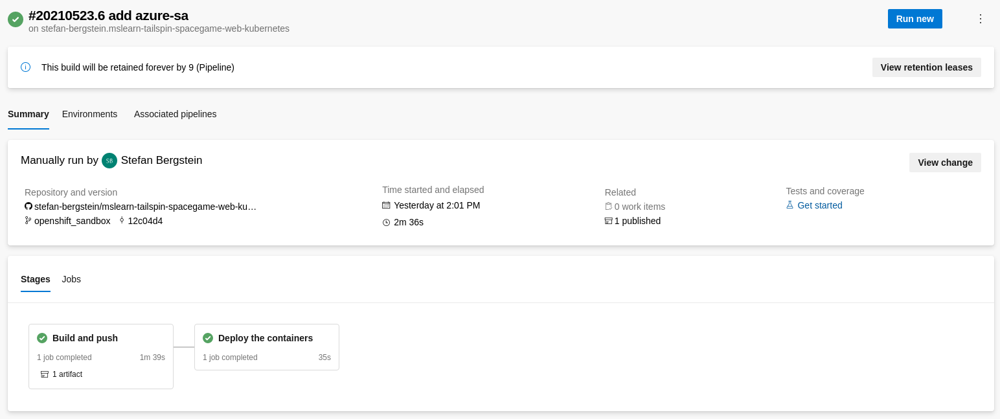

# CI/CD with Azure DevOps and OpenShift

In this tutorial we are going to setup a CI/CD pipeline in Azure DevOps. The pipeline builds a small .Net application and deploys it to OpenShift.

The steps are based on the Microsoft learning path module
[Automate multi-container Kubernetes deployments with Azure Pipelines](https://docs.microsoft.com/en-us/learn/modules/deploy-kubernetes/). But instead of deploying to AKS, the application will be deployed on OpenShift.

## Setup your OpenShift Kubernetes cluster
Azure DevOps requires network connectivity to your OpenShift Kubernetes cluster. [Microsoft Azure Red Hat OpenShift](https://www.openshift.com/products/azure-openshift) or a self-managed [OpenShift Cluster on Azure](https://docs.openshift.com/container-platform/4.7/installing/installing_azure/installing-azure-default.html) are great options. 
However, in this tutorial we are using the [Developer Sandbox for Red Hat OpenShift](https://developers.redhat.com/developer-sandbox), because it is even quicker and free.

### Get your Developer Sandbox

Navigate to [Get started in the Sandbox](https://developers.redhat.com/developer-sandbox/get-started) and hit **Launch your Developer Sandbox for Red Hat OpenShift**. Log in to your Red Hat account. Don't have an account? Create one now. It is free too. 
Login into you Red Hat OpenShift development cluster bu pressing **Start using your sandbox**.

The sandbox contains two projects/namespaces. `<redhat-account-name>-dev` and `<redhat-account-name>-stage`.

Download the oc OpenShift Command Line Interface (CLI) via  **(?)** select **Command line tools**.


Login with thc oc CLI by, 
- navigating to **\<redhat-account\>**,  select **Copy login command**, and  **Display token**,
- and enter `oc login --token=sha256~xxxyyyzz --server=https://api.sandbox-xxxyyyzzz.openshiftapps.com:6443` in your local shell.


### Create a service account for Azure DevOps


Switch to the stage project:
```
$ oc project <redhat-account-name>-stage
```

Create a service account for Azure DevOps:
```
$ cat << EOF | oc apply -f -
apiVersion: v1
kind: ServiceAccount
metadata:
  name: azure-sa
EOF

serviceaccount/azure-sa created

```

Add `edit` role to the service account: 
```
$ oc policy add-role-to-user edit system:serviceaccount:<redhat-account-name>:azure-sa

clusterrole.rbac.authorization.k8s.io/edit added
```

## Set up your Azure DevOps environment

Follow the instructions in [Exercise - Set up your Azure DevOps environment](https://docs.microsoft.com/en-us/learn/modules/deploy-kubernetes/3-set-up-environment) with a few exceptions:

1. Don't deploy the Azure Kubernetes Service. 
2. Skip the `az role assignment create` command to create a role assignment to authorize the AKS cluster to connect to the Azure Container Registry.
3. Don't create the service connection to Azure Kubernetes Service.
4. Don't create a environment for Azure Kubernetes Service, but an generic Kubernetes environment for OpenShift.


### Create the environment generic Kubernetes environment for OpenShift


1. In Azure DevOps, under **Pipelines**  , select **Environments**.
2. Select **Create environment**.
3. Under **Name**, enter *openshift-sandbox*.
4. Under **Resource**, select **Kubernetes**.
5. Select **Next**. 
6. Under **Provider**, select **Generic provider (exiting service account)**.
7. Under **Cluster Name**, enter *sandbox*.
8. Under **Namespace**, enter *\<redhat-account-name>-stage*.
9. Run `kubectl config view --minify -o jsonpath={.clusters[0].cluster.server}` and enter the URL under **Server URL**.
10. Switch to the stage project/namespace and get service account secret
```
$ oc project <redhat-account-name>-stage
$ kubectl get serviceAccounts azure-sa  -o=jsonpath={.secrets[*].name}

azure-sa-dockercfg-w8b9s azure-sa-token-dkhx8

# Use the token from the output ^^^

$ kubectl get secret azure-sa-token-dkhx8  -o json

{
    "apiVersion": "v1",
    "data": {
...
    },
    "type": "kubernetes.io/service-account-token"
}

```
11.  Under **Secret**, enter the json output from the last command. 
12.  Select **Validate and create**.


13.  Under **Project Settings**, select **Service Connection**.
14.  Copy the name of the new Kubernetes service connection **openshift-sandbox-\<redhat-account-name>-stage-######**. E.g, *openshift-sandbox-stefan-bergstein-stage-1621852211065*

### Update the Kubernetes deployment manifest in your GitHub source project
 Follow the instructions in [Exercise - Set up your Azure DevOps environment](https://docs.microsoft.com/en-us/learn/modules/deploy-kubernetes/3-set-up-environment) under **Update the Kubernetes deployment manifest...**


## Deploy a multi-container solution to Kubernetes
 

### Switch the application to non-privileged 

First we will update a few manifests so that the application runs well as non-root, because privileged containers are not allow by default on OpenShift:
  - Update the two Dockerfiles so that the application runs well as non-root.
  - Update the `containerPort` in the `deployment.yml` 
  - Update the `service.yaml` with the correct ports and add a openshift route.

**Update the two Dockerfiles so that the application runs well as non-root**
Go to your GitHub repository and update:
- `mslearn-tailspin-spacegame-web-kubernetes/Tailspin.SpaceGame.LeaderboardContainer/Dockerfile`
- `mslearn-tailspin-spacegame-web-kubernetes/Tailspin.SpaceGame.Web/Dockerfile`

In each file, replace `EXPOSE 80` with the following lines:

```
# Serve on port 8080, we cannot serve on port 80 with a custom user that is not root.
ENV ASPNETCORE_URLS=http://+:8080
EXPOSE 8080
```


Next, edit the file `mslearn-tailspin-spacegame-web-kubernetes/manifests/deployment.yml` and change the `containerPort` to `8080`
Double check that the image contains your ACR name.


Update the `service.yaml` with the correct ports and add a openshift route:
```yaml
apiVersion: v1
kind: Service
metadata:
  name: leaderboard
spec:
  selector:
    app: leaderboard
  ports:
    - protocol: TCP
      port: 80
      targetPort: 8080
---
apiVersion: v1
kind: Service
metadata:
  name: web
spec:
  selector:
    app: web
  ports:
    - protocol: TCP
      port: 80
      targetPort: 8080
---
kind: Route
apiVersion: route.openshift.io/v1
metadata:
  name: web
spec:
  to:
    kind: Service
    name: web
    weight: 100
  port:
    targetPort: 8080
  wildcardPolicy: None
```

Save, stage, commit and push all the changes.

### Update the pipeline

In this part, you'll:
- Update the pipeline to support CI/CD on a commit to the master branch.
- Define some pipeline variables to make the build pipeline easier to maintain.
- Add a task to build and publish the leaderboard container to your container registry.
- Add a task to publish Kubernetes manifests from the Build stage so that they can be downloaded for use in the Deploy stage.
- Add a task to create an image pull secret for use between your Kubernetes and container registry instances.
- Add a task to deploy updated images to a Kubernetes cluster.
- Save the pipeline to trigger a CI/CD workflow.


 Follow the instructions in [Exercise - Deploy a multi-container solution to Kubernetes](https://docs.microsoft.com/en-us/learn/modules/deploy-kubernetes/4-deploy-kubernetes) with a few exceptions: 
1. Set the `environment` to `'openshift-sandbox.<redhat-account-name>-stage'` instead of  `'spike.default'`
2. Set the `kubernetesServiceConnection` to service connection you copied above: **openshift-sandbox-\<redhat-account-name>-stage-######**. E.g, *openshift-sandbox-stefan-bergstein-stage-1621852211065* 
3. Set the `namespace` to `'<redhat-account-name>-stage'` instead of  `'default'`
4. In the section **Save the pipeline to trigger a build and release**, please use the OpenShift Console to get te URL of the deployed application.


You can follow the Pipeline run in Azure DevOps:



### Check the application

Navigate to you OpenShift Sandbox, check the deployments:


Click on the Route URL to ope the example application:


## Troubleshooting
- Compare your changes with the files in this example repository: https://github.com/stefan-bergstein/mslearn-tailspin-spacegame-web-kubernetes/tree/openshift_sandbox
