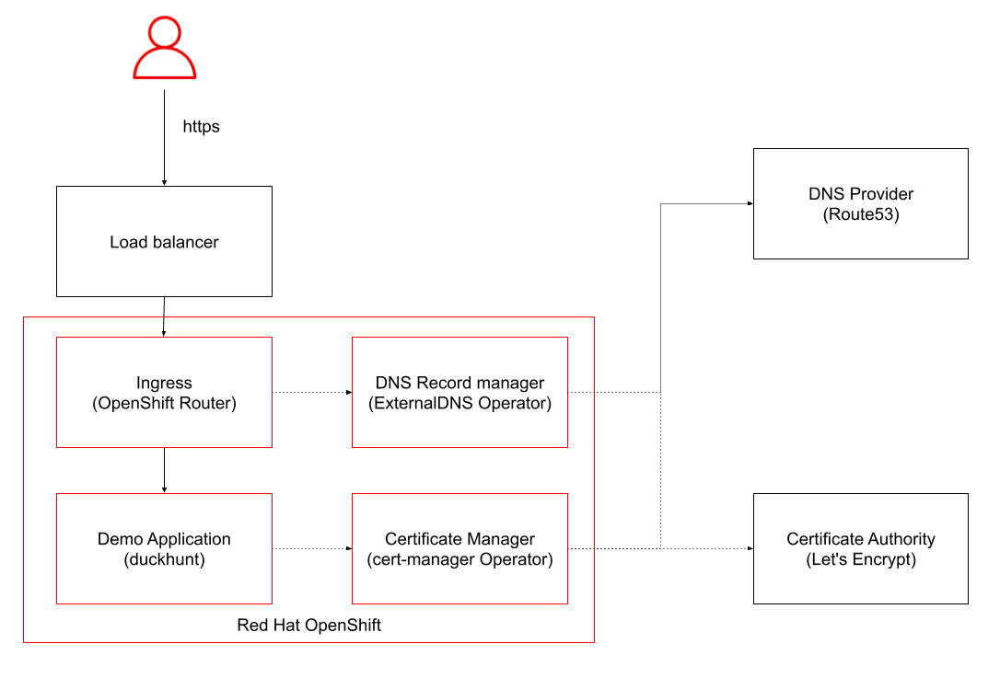
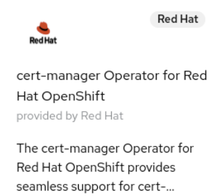
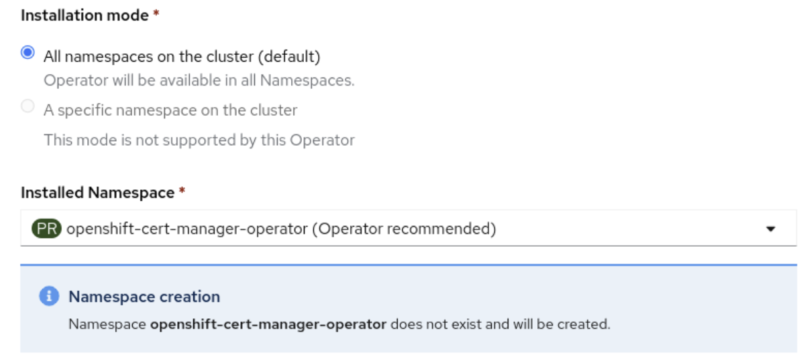
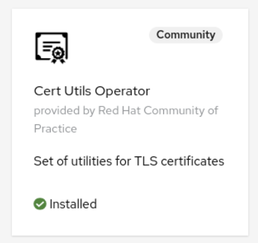
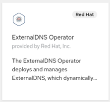

# Configuring custom domains for applications - the operator-way!


*Human readable domain names for applications hosted on OpenShift.  Easy, simple, secure and automated*.


On a rainy Thursday evening, I was looking at a lemon tree and the lengthy URL of an application that I deployed some time ago on my OpenShift cluster. And I was wondering how I can make it shorter and human readable. Creating an edge route with a custom certificate is rather simple [[1]](https://docs.openshift.com/container-platform/4.10/networking/routes/secured-routes.html#nw-ingress-creating-an-edge-route-with-a-custom-certificate_secured-routes). However, what I wanted to explore was the part about automating the required certificate and DNS management. There are quite a few ways to configure custom domains for applications in Kubernetes and this post will focus on automation.


# Exposing applications on OpenShift

Red Hat OpenShift provides simplified installation and out-of-the-box configuration, allowing you to get up and running faster and streamline application development by using OpenShift to improve developer productivity. During the installation  process, OpenShift builds out a simple common domain naming structure.

Any application can easily expose a service with an OpenShift route. Routes are kind of similar to Kubernetes Ingress (see [[2]](https://cloud.redhat.com/blog/kubernetes-ingress-vs-openshift-route)).

A common OpenShift domain structure is ```<app-name>.<cluster-domain>```, e.g. ```myapp.mydomain```. The first component of this URL refers to the full application name, while the second component is the cluster of that name. On Red Hat OpenShift on AWS, applications are exposed with a domain name ```<app-name>.<clustername>.<UniqueID>.p1.openshiftapps.com```. With a custom domain name, you can expose a simple name like ```shop.teecay.io```.


# Approach

For automating the end to end process of configuring custom domains for applications, we need a few components:

* A certificate authority to sign certificates. Let's use [Let's Encrypt](https://letsencrypt.org/) for this experiment.
* A Certificate manager that manages X.509 certificates specifically for cloud native Kubernetes or OpenShift environments. The cert-manager Operator for Red Hat OpenShift is the first choice for this scenario. 
* Something that dynamically manages DNS records in external DNS Providers for specific Kubernetes resources such as ingress and routes. The OpenShift ExternalDNS Operator can help here.
* A Domain Name System service that can be automated with cert-manager and the ExternalDNS Operator. Amazon Route 53 is the choice but many others work fine with Let's Encrypt and cert-manager, too.
* And finally, a domain name for your use case. 


*Components for automating custom domains for applications*


# Let's go

What are the required steps?

1. Deploy a demo application. 
2. Configure an AWS user for accessing Route53.
3. Install and configure cert-manager on OpenShift.
4. Install the Cert Utils Operator.
5. Install and configure ExternalDNS.
6. Expose the demo application with a secure, custom domain name.


## Deploy a demo application 

First things first. Let's have some fun.

*Duck hunt game:*


Quick and dirty … because you have good OpenShift Kubernetes knowledge. Otherwise you would not read this post, right?

```bash
$ oc new-project sandbox

$ oc apply -f https://raw.githubusercontent.com/stefan-bergstein/openshift-tutorials/main/k8s-basics/duckhunt.yaml -n sandbox

$ oc expose service duckhunt

$ oc get route duckhunt -n sandbox
```


Expected output:
```
NAME       HOST/PORT                                                  PATH   SERVICES   PORT   TERMINATION   WILDCARD
duckhunt   duckhunt-sandbox.apps.<cluster-domain>                     duckhunt   web                  None
```


So, hunt some ducks at ```http(s)://duckhunt-sandbox.apps.<cluster-domain>``` :-)

Depending on your OpenShift Cluster installing, the route is not secured:


## Configure a AWS user for accessing Route53

Prerequisite for this step is an AWS account, the aws cli configured and a hosted zone in Route 53, which can be used for this tutorial.

And you need to own a domain name that is managed via Route 53. In this tutorial, it is assumed that you have and own a hosted zone on AWS Routes 53. If not, you might follow along with your DNS service such as Cloudflare.

Create a file with a policy for accessing Route 53:

```json
{
   "Version": "2012-10-17",
   "Statement": [
       {
           "Effect": "Allow",
           "Action": "route53:GetChange",
           "Resource": "arn:aws:route53:::change/*"
       },
       {
           "Effect": "Allow",
           "Action": [
               "route53:ChangeResourceRecordSets",
               "route53:ListResourceRecordSets"
           ],
           "Resource": "arn:aws:route53:::hostedzone/*"
       },
       {
           "Effect": "Allow",
           "Action": [
               "route53:ListHostedZones",
               "route53:ListResourceRecordSets",
               "route53:ListHostedZonesByName"
           ],
           "Resource": "*"
       }
   ]
}
```

Create the policy and capture the ARN:

```bash
aws iam create-policy --policy-name AllowDNSUpdates --policy-document  file://policy.json

export POLICY_ARN=$(aws iam list-policies --query 'Policies[?PolicyName==`AllowDNSUpdates`].Arn' --output text)
```


Create a user and attach the policy:


```bash
$ aws iam create-user --user-name route53-openshift

$ aws iam attach-user-policy --policy-arn $POLICY_ARN --user-name route53-openshift 
```


Create and capture the AccessKey:  
```bash
$ aws iam create-access-key --user-name route53-openshift --output json
{
    "AccessKey": {
        "UserName": "route53-openshift",
        "AccessKeyId": "XXXXXXXXXXXXXXXXXXXXXX",
        "Status": "Active",
        "SecretAccessKey": "**********************************",
        "CreateDate": "2022-11-24T11:06:20+00:00"
    }
}
```


Later on we will create secrets for the cert-manager and External DNS Operator with the AccessKey and SecretAccessKey.


## Install and configure cert-manager on OpenShift

Navigate to the Operator Hub and install the cert-manager Operator for Red Hat OpenShift:





Use the default and recommended setting:




Wait until the operator is ready.

Now, generate a secret with the AWS secret-access-key for Route53: 

(no need to say that you insert your values for XXXX and ****)


```
$ oc create secret generic prod-route53-credentials-secret --from-literal secret-access-key="**********************************" -n openshift-cert-manager
```


Now create a cluster issuer yaml for Let's encrypt and apply it in the openshift-cert-manager namespace:


```yaml
apiVersion: cert-manager.io/v1
kind: ClusterIssuer
metadata:
  name: letsencrypt-prod
spec:
  acme:
    email: your.name@mail.com
    preferredChain: ''
    privateKeySecretRef:
      name: letsencrypt-account-key
    server: 'https://acme-v02.api.letsencrypt.org/directory'
    solvers:
      - dns01:
          route53:
            accessKeyID: XXXXXXXXXXXXXXXXXXXXXX
            region: eu-central-1
            secretAccessKeySecretRef:
              key: secret-access-key
              name: prod-route53-credentials-secret
        selector:
          dnsZones:
            - your-domain.com
```


Please update [your.name@mail.com](mailto:your.name@mail.com), accessKeyID: XXXXXXXXXXXXXXXXXXXXXX and your-domain.com. You don't need to create a secret with the letsencrypt-account-key, because the cert-manager will save the account key automatically.


### Extra step if your OpenShift deployment lives behind a firewall that blocks external DNS requests

In the OpenShift Console Navigate to Administrator ->  Installed Operators -> cert-manager Operator for Red Hat OpenShift -> CertManagers

Edit the cluster CertManager yaml and add …


```
 unsupportedConfigOverrides:
    controller:
      args:
        - '--v=2'
        - '--cluster-resource-namespace=$(POD_NAMESPACE)'
        - '--leader-election-namespace=kube-system'
        - '--dns01-recursive-nameservers-only'
        - '--dns01-recursive-nameservers=jj.qq.pp.zz:jj.qq.pp.yy:53'
```


… and replace jj.qq.pp.zz:jj.qq.pp.yy with your company's DNS servers, which (hopefully) get the DNS challenge in time.


## Install the Cert Utils Operator

Navigate to the Operator Hub and install the Cert Utils  Operator.




Why do we need this operator? The cert-manager creates and stores certificates (actual certificate and private key of the certificate) in Kubernetes secrets. This certificate needs to be injected into OpenShift routes.  


## Install and configure the ExternalDNS Operator

Navigate to the Operator Hub and install the ExternalDNS Operator:




Depending on your OpenShift and ExternalDNS Operator version (&lt;1.0.0), you might need to create the operand namespace manually.

First, create secret with the AWS keys for Route53:


```bash
oc create secret generic route53-credentials-secret --from-literal aws_access_key_id=XXXXXXXXXXXXXXXXXXXXXX --from-literal aws_secret_access_key="**********************************" -n external-dns-operator
```


And now a ExternalDNS yaml:
```yaml
apiVersion: externaldns.olm.openshift.io/v1beta1
kind: ExternalDNS
metadata:
  name: sample-aws
spec:
  domains:
    - filterType: Include
      matchType: Exact
      name: your-domain.com
  provider:
    aws:
      credentials:
        name: route53-credentials-secret
    type: AWS
  source:
    fqdnTemplate:
      - '{{.Name}}.your-domain.com'
    hostnameAnnotation: Ignore
    openshiftRouteOptions:
      routerName: default
    service:
      serviceType:
        - LoadBalancer
    type: OpenShiftRoute
  zones:
    - AABBCCDDEEFF
```


Replace your-domain.com and the zone id AABBCCDDEEFF with your data. You can list the zone id with **aws route53 list-hosted-zones**


```
$ aws route53 list-hosted-zones
HOSTEDZONES      /hostedzone/AABBCCDDEEFF       your-domain.com.   
```


## Expose the demo application with a secure, custom domain name.

Navigate to the installed cert-manager operator in the sandbox namespace and create a certificate.


```yaml
apiVersion: cert-manager.io/v1
kind: Certificate
metadata:
 name: duckhunt
 namespace: sandbox
spec:
 dnsNames:
   - duckhunt.your-domain.com
 issuerRef:
   kind: ClusterIssuer
   name: letsencrypt-prod
 secretName: duckhunt-your-domain-certificate
```


Please replace` your-domain` and` your-domain.com` with the data of your domain.

After a moment, the status should switch from **Issuing** to **Ready**.

If not, check log of the cert-manager pod logs and check what went wrong [[3]](https://cloud.redhat.com/blog/kubernetes-ingress-vs-openshift-route)

In case you see an error like this… 


```log
E1125 13:44:12.776024       1 sync.go:186] cert-manager/challenges "msg"="propagation check failed" "error"="dial tcp 205.251.193.134:53: i/o timeout" "dnsName"="duckhunt2.your-domain.com" "resource_kind"="Challenge" "resource_name"="duckhunt2-7sv2v-1344921550-4039986514" "resource_namespace"="sandbox" "resource_version"="v1" "type"="DNS-01""
```

… you should check if your firewall blocks DNS traffic and use your company's name servers. Update the cluster CertManager resource with the dns01-recursive-nameservers options. See also [[3]](https://cloud.redhat.com/blog/kubernetes-ingress-vs-openshift-route).


```yaml
  unsupportedConfigOverrides:
    controller:
      args:
        - '--v=2'
        - '--cluster-resource-namespace=$(POD_NAMESPACE)'
        - '--leader-election-namespace=kube-system'
        - '--dns01-recursive-nameservers-only'
        - '--dns01-recursive-nameservers=1.2.3.4:53,1.2.3.5:53'
```

So, now the final configuration step. Create a route. As usual, please replace` your-domain` and` your-domain.com` with the data of your domain.


```yaml
kind: Route
apiVersion: route.openshift.io/v1
metadata:
  name: duckhunt-tls
  namespace: sandbox
  annotations:
    cert-utils-operator.redhat-cop.io/certs-from-secret: duckhunt-your-domain-certificate
spec:
  host: duckhunt.your-domain.com
  to:
    kind: Service
    name: duckhunt
    weight: 100
  tls:
    termination: edge
  port:
    targetPort: web
  wildcardPolicy: None    
```


The Cert Utils Operator will inject the `duckhunt-your-domain-certificate ` certificate into the route.

And the ExternalDNS Operator is adding a DNS record:


```bash
$ nslookup duckhunt.your-domain.com
duckhunt.your-domain.com   canonical name = router-default.apps.<cluster-domain>.
```


So, hunt some more ducks at your new, secure custom domain  https://duckhunt.your-domain.com  :-)


# Conclusion

Configuring your DNS provider for API access, the ExternalDNS and Cert-Manager Operators will take maybe an hour when you do this for the first time. After that, it is very simple and fast to create secured routes with human readable domain names.. 


# References 

[1] [Secured routes - Configuring Routes | Networking | OpenShift Container Platform 4.10](https://docs.openshift.com/container-platform/4.10/networking/routes/secured-routes.html#nw-ingress-creating-an-edge-route-with-a-custom-certificate_secured-routes)

[2] [Kubernetes Ingress vs OpenShift Route](https://cloud.redhat.com/blog/kubernetes-ingress-vs-openshift-route)

[3] [DNS01 - cert-manager Documentation](https://cert-manager.io/docs/configuration/acme/dns01/)
